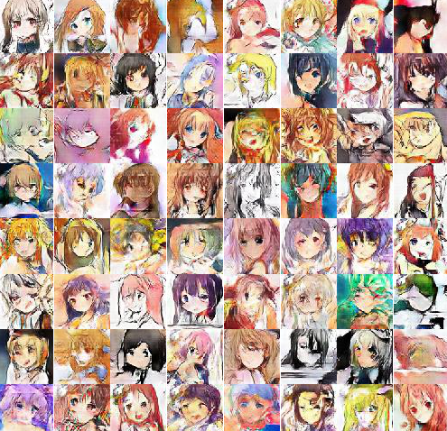

# Comic_GAN
> This project is about to use DCGAN to generate manga/comic character faces. 

## Data Set
Images are collected from [danbooru](http://danbooru.donmai.us/) using [icrawler](https://github.com/hellock/icrawler) and preprocessed using [python-animeface](https://github.com/nya3jp/python-animeface). 

Thanks to @jayleicn, an alternative data set that contains 115085 images in 126 tags can be found at 

- Brine (a python-based dataset management library): https://www.brine.io/jayleicn/anime-faces 
- Google Drive: https://drive.google.com/file/d/0B4wZXrs0DHMHMEl1ODVpMjRTWEk/view?usp=sharing
- BaiduYun: https://pan.baidu.com/s/1o8Nxllo

Non-commercial use please.

## Usage

- Usage the following command to start the jupyter notebook
```bash
# start the jupyter notebook server
jupyter notebook
```
- Open the 'Data_Visualization' notebook and run all
- Observe the generated result

## Training

- Download the data set and extract the images into a folder
- Set up the envionment using Anaconda
- Run the following command:
```bash
$ python main.py --dataDir path_to_dataset 
```

## Randomly Generated Results

The following images are generated after training on roughly 100,000 data for 100 epochs with a smaller than default learning rate.




The image quality is not at an acceptable level but it starts to show the faces. 